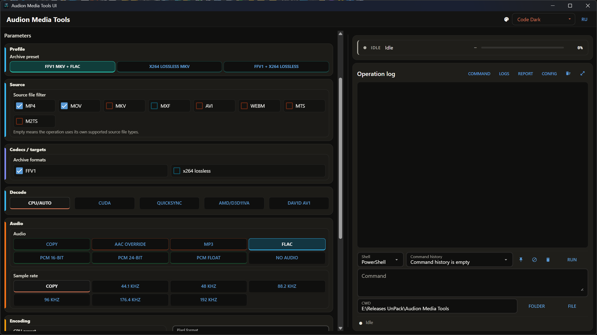

# Audion Media Tools

<!-- audion:release -->
<p align="center">
  <a href="https://audion.dev/downloads/media-tools"></a>
  <a href="https://github.com/Tensionix/media-tools/releases/latest"></a>
  <a href="https://github.com/Tensionix/media-tools/releases"></a>
  <a href="https://github.com/Tensionix/media-tools/blob/main/LICENSE"></a>
</p>

**Version 2.5.2** · 2026-09-01 · 11.7 MB

- [Direct download](https://dl.audion.dev/media-tools/2.5.2/Audion_Media_Tools_v2.5.2.zip) — unmetered, no rate limits
- [Project page](https://audion.dev/downloads/media-tools) — every version and how to install

<p align="center"></p>

`SHA-256: c665d4b2fbd5eca53f680d852cfea2b735d9ceb8169b292f778678ed48a056b0`

---

An **Audion** tool, published by [Tensionix](https://github.com/Tensionix).
<!-- /audion:release -->

Audion Media Tools is a portable Windows GUI for FFmpeg, ffprobe and yt-dlp workflows.

The project started as a command-launcher pack and now provides a NiceGUI interface with profiles, pinned path caches, one-shot source probing, a persistent operation log and media-focused pages for content production.

## FFmpeg and your NVIDIA driver

Newer is not always better. Every FFmpeg build is compiled against one specific
version of the NVENC headers, and each of those demands a minimum driver. Put
the newest build on an older driver and hardware encoding does not get faster —
it stops working.

| FFmpeg build | NVENC headers | Minimum NVIDIA driver (Windows) |
|---|---|---|
| 9.0.1 | ffnvcodec n13.1.15.0 | **610.0** |
| 8.0.1 | ffnvcodec n13.0.19.0 | **570.0** |
| 7.1.1 | ffnvcodec n13.0.19.0 | **570.0** |
| 7.1 | ffnvcodec n12.2.72.0 | 551.76 |

Note the third row: 7.1.1 is built with the same headers as 8.0.1, so it needs
the same 570.0 — going "one version back" buys nothing on an older driver. The
step that does help is 7.1 without the patch release.

This is why the installer picks a build from your driver version instead of
always taking the latest. The versions above are read from the build's own
README; the driver thresholds come from the nv-codec-headers README.

If you have no NVIDIA GPU, none of this applies — the latest build is installed
and encoding runs on the CPU.

**Which build ships with this product: 8.0.1.** That is a deliberate choice, not
a missed update. Most editing and encoding machines today run drivers roughly
between 571 and 609; the 610 branch is installed by very few. Both 8.1.x and
9.x demand that branch — shipping them would advertise NVIDIA hardware encoding
and then deny it to most of the people it was promised to. 8.0.1 has everything
these products use and runs on the drivers people actually have.


## Start

```bat
launcher_gui.cmd
```

Build or repair the portable Python GUI environment:

```bat
builder_main.cmd
```

`builder_main.cmd` also has separate installer entries for BtbN FFmpeg, Gyan FFmpeg, yt-dlp and 7-Zip.

## Canonical Workbench labels

Workbench uses the same Audion Image Tools public vocabulary in every project. Its buttons always keep the same order and labels: **Source**, **Add file...**, **Target**, **Reset**, **Delete**, **List**.

`Reset` returns to project `Source\`/`Transcoded\` and does not delete files; `Delete` clears the current `Source` and `Target` only after confirmation. The exact Russian labels are **Источник**, **Добавить файл...**, **Назначение**, **Сбросить**, **Удалить**, **Список**. The Workbench variants `Destination`, `Clear`, `Цель`, and `Очистить` are not used.

## Key Folders

- `Source\` - default input.
- `Transcoded\` - default destination / OUT.
- `Download\` - YouTube output and link files.
- `LUTs\` - LUT files and LUT cache.
- `Scripts\` - stable CLI preset wrappers backed by `config\script_profiles.yaml` and `Scripts\Common\script_runner.py`.
- `Tools\` - reproducible external media tools: FFmpeg, yt-dlp, Deno and 7-Zip.
- `config\tool_manifest.yaml` - GUI tree, fields and presets.
- `system_core\ui_nicegui\app.py` - GUI.
- `system_core\services\media_service.py` - media command services.

The portable installers replace tool payloads cleanly. Builder exposes BtbN FFmpeg above Gyan FFmpeg as separate choices; both reset `Tools\ffmpeg\` before recreating `Tools\ffmpeg\bin\`. yt-dlp resets `Tools\yt-dlp\` and installs Deno into `Tools\deno\` for external JavaScript runtime support. 7-Zip resets `Tools\7zip\`. Portable PowerShell similarly replaces `system_core\powershell\`, and FZF replaces `system_core\fzf.exe`.

`cleanup_project.cmd` clears rebuildable payloads and generated state: `runtime\`, `wheelhouse\`, `install\download\`, media tool folders, portable PowerShell/FZF, logs/reports/workspace/release/data and `Transcoded\`. It leaves user-facing `Source\`, `Download\` and `LUTs\` untouched.

The workspace `File List` button prints the current Source file names in the terminal without paths, including extensions, sorted alphabetically with a numbered left column.

## Pages

- Diagnostics
- Download / YouTube
- Audio streams
- Archive
- Editing codecs
- Storage
- Delivery / publishing
- Package / remux
- FPS / cadence
- Color / LUT

Diagnostics include inventory, tool selftest, Profile Doctor for GUI/CLI preset consistency, Preset Test Matrix for 1-second fixture checks, and Hardware Capabilities smoke tests for CPU, QSV/NVENC/AMF H.264, HEVC and AV1, SVT-AV1 and dav1d.

Full local acceptance uses `system_core\smoke_media_operations.py` for the GUI/backend contract and `system_core\smoke_cli_profiles.py` for CLI wrappers plus `ffprobe`. Networked YouTube profiles are command-previewed without downloading; `yt-selftest` is executed for real.

Media operations run a preflight before FFmpeg/yt-dlp work starts. It checks Source/OUT, matching input files, LUT selection, remux compatibility and required FFmpeg encoders. Hardware profiles are also checked against the latest machine-local `Hardware Capabilities` cache. Each operation writes `batch_report.md` and `batch_report.json` into its own `report\...` run folder; the GUI `Report` button opens the recent-runs page. Source is scanned recursively, and normal batch outputs use `OUT\<operation>\<suffix>\<Source mirror>\<original name>.<ext>`. A custom OUT folder simply replaces the default `Transcoded` root.

Audio operations support three workflows: extract audio into separate files, update audio inside a video container with `-c:v copy`, and convert standalone audio files. They support stream selection, WAV/FLAC/M4A/MP3/Opus outputs, SoX/libsoxr resampling, the LAME V0/Insane 320/manual scale shared with the encode pages and the CLI, channel modes, LUFS report-only, one-pass and two-pass loudnorm. They also write `audio_report.md` and `audio_report.json` next to the batch report.

Remux is target-driven: the GUI selects `Video`, `Audio` or `Video&Audio`, then an output container. Source formats are detected per file, audio-only copy targets include M4A, ALAC/M4A, MKA, AAC, AC3, EAC3, DTS, FLAC, WAV, MP3, OPUS and OGG, and incompatible files are skipped with a log reason. Both the container pair and the codec inside the file are checked, so ProRes never goes into MP4 and HEVC never goes into MXF.

Color / LUT profiles include a controllable pre-LUT gamma field for `Pre-expose + LUT` and `Pregamma + LUT`. The GUI shows a centered 18% gray before/after preview so the numeric gamma value can be judged visually before running FFmpeg. LUT paths are escaped through the shared FFmpeg filtergraph helper used by both GUI and CLI wrappers.

WebM is currently treated as an input, download and remux/download scenario, not as a general batch encode target. Two independent encoders can run at the same time, but they share CPU/GPU/disk resources; avoid writing to the same output file or sharing mutable legacy LUT state.

## Terminal, Commands And Reports

The right column keeps the short status and global progress above the terminal. Detailed command output stays in the terminal.

- `Command` runs the selected GUI operation in dry-run mode and prints the command that would be executed.
- FFmpeg operations print compact `[PROGRESS]` lines for the current file when duration is available through ffprobe.
- The `Report` button opens a recent-runs page with report/log/JSON/OUT links and command repeat.
- The command bar below the terminal is for administrative utilities. It has Shell, CWD, multiline monospace command text, command history, pins and file/folder pickers.

The main user guides are `USER_GUIDE_RU.md` and `USER_GUIDE_EN.md`. The Russian guide in `Docs\README_RU.md` remains a compact project map.

Deep-dive procedure notes live in `Docs\docs\`, including `AUDIO_WORKFLOWS_RU.md`, `ENCODING_PIPELINES_RU.md`, `REMUX_FPS_LUT_RU.md`, `HARDWARE_DIAGNOSTICS_RU.md`, `MEDIA_KNOWN_PITFALLS_RU.md` and `MEDIA_SMOKE_TEST_CHECKLIST_RU.md`.

## Licensing

Audion-authored source, scripts and docs are released as `GPL-3.0-or-later`; see the project `LICENSE` and `Docs\LICENSE (GPL-3.0-or-later).md`.

FFmpeg, yt-dlp, Deno, 7-Zip, PowerShell, fzf, Python Embedded and Python packages keep their own licenses. Regenerate `licenses\THIRD_PARTY_NOTICES.md` from the final staged package before publishing. If FFmpeg binaries are bundled, publish or link the matching FFmpeg source/build information with the release.

## Detailed Operator Reference

The GUI manifest is the structured source of the operation tree, field types, bilingual labels, defaults, conditional visibility, tooltips, presets, and backend commands. This README converts those definitions into an operator-oriented map. A manifest entry answers what the interface can express; this section explains why an operator would choose it and what must be verified afterward.

### Workbench And Path Model

The canonical Workbench controls the active source and destination for the selected operation. `Source` can point to the project input folder, a selected folder, or one selected file where the operation supports it. `Target` selects the output root. `Reset` returns to project defaults without deleting user data, while `Delete` is a confirmed cleanup action. `List` prints the current source filenames in a stable alphabetical list so the operator can verify scope before starting a batch.

Source discovery is recursive for normal batch workflows. Output paths mirror source subfolders below the operation and profile folders; this prevents two same-named files from different source directories from colliding. A custom target replaces the default `Transcoded` root but retains the managed internal structure. Do not point Source and Target at the same mutable directory, and never treat an empty target as proof that the source may be deleted.

Pinned paths and recent-path caches improve repeat work, but they are conveniences rather than evidence. The report records the paths and resolved parameters used by the backend. Use `Probe Source` deliberately for media inspection; it is not run continuously because recursive ffprobe work can be expensive on large trees.

### Diagnostics And Capability Checks

Run diagnostics before a large or hardware-specific job. Inventory checks the expected portable components. Tool self-test validates FFmpeg, ffprobe, yt-dlp, Deno, and related executables. Profile Doctor compares GUI operations, stable CLI wrappers, and the shared profile catalogue. Preset Test Matrix runs short fixture-based checks instead of assuming that a command line accepted by one FFmpeg build will work on another.

Hardware Capabilities tests CPU encoding plus the available QSV, NVENC, AMF, SVT-AV1, and dav1d paths. Missing hardware or drivers should be reported as unavailable rather than misclassified as a project failure. The resulting machine-local cache informs preflight. If the cache belongs to another machine or is absent, rerun diagnostics before relying on a hardware backend.

### Decoder And Encoder Selection

Decoder and encoder choices are independent. Decoder options include automatic CPU behavior, CUDA, QuickSync, AMD/D3D11VA, and dav1d for AV1. Encoder options include software CPU, NVIDIA NVENC, Intel QSV, and AMD AMF. Selecting an encoder exposes its native quality controls rather than forcing unrelated CPU terminology onto hardware encoders.

Software x264/x265 uses the familiar `fast` through `veryslow` preset scale. Slower values spend more CPU searching for compression efficiency and are not automatically more appropriate for every delivery. NVENC exposes P-presets such as p5, p6, and p7. QSV has its own `veryfast` through `veryslow` scale. AMF uses speed, balanced, and quality modes. These scales are not equivalents; choose them by backend capability, turnaround time, and acceptance testing.

The selected pixel format also applies to hardware encoders: it is translated into that encoder's native format (`yuv420p10le` becomes `p010le`, and QSV takes `nv12` instead of `yuv420p`). Combinations the encoder cannot produce, such as 10-bit on H.264 NVENC/QSV/AMF, are reported as a preflight error instead of being silently written in a different format. Encoding tuning holds x264/x265 `tune` values, so it is shown only for the CPU encoder; hardware backends expose their own quality scales instead. Encoding tuning can describe grain, film, animation, fast-decode, or zero-latency priorities. Quality values and presets must be evaluated together with resolution, pixel format, container, source complexity, and playback requirements. A successful hardware command still requires visual inspection and an ffprobe check of the resulting streams.

### Download And YouTube Workflows

Download operations use yt-dlp through the project backend. The source can be one URL or a maintained batch file. Profiles cover best-quality and compatibility-oriented MP4 choices, upload-oriented output, and custom video/audio selection. Options for retries, IPv4, metadata, thumbnails, playlist behavior, subtitles, cookies, and fragment concurrency change both reliability and the contents of the final package.

Before a network batch, run the yt-dlp self-test and review command preview. Keep the URL list with the report, and inspect failed items separately because access restrictions, authentication, unavailable formats, JavaScript requirements, and transient network failures need different remedies. WebM is supported where the selected download/remux workflow calls for it; it is not silently treated as a universal encode target.

### Audio Workflows

Audio work is divided into three user intentions: extract audio from media, replace or convert audio inside a video while copying the video stream, and convert standalone audio. Stream selection matters whenever a source contains several languages, commentary tracks, multichannel mixes, or attachments. Confirm the selected stream by language, channel layout, codec, and disposition rather than assuming stream zero is correct.

Output choices include WAV, FLAC, M4A, MP3, Opus, and container-specific copy modes. Resampling uses the selected sample rate and may use SoX/libsoxr quality paths. MP3 offers quality-oriented or fixed-bitrate modes. Loudness workflows include analysis-only reporting and one-pass or two-pass normalization; two-pass processing should preserve the measured values in the report so the applied correction is reproducible.

When updating audio inside video, `-c:v copy` avoids image recompression, but the chosen audio codec must still be compatible with the output container. PCM and FLAC are generally safer in MOV or MKV than MP4. Review synchronization, duration, channel layout, loudness, and stream metadata after processing. Audio operations create both batch and audio-specific reports.

### Archive And Editing Codecs

Archive profiles target reversible or carefully controlled master storage, including FFV1 and lossless x264 scenarios. They are intentionally separate from compact delivery encodes. Estimate storage before a large archive run, retain checksums, and test decoding from the final storage location rather than only from the working disk.

Editing-codec profiles create intermediate files for NLE systems. ProRes Proxy, LT, 422, and HQ and DNxHR HQ/HQX are paired with supported MOV or MXF containers. The page has no pixel format control because each mezzanine target fixes its own: ProRes writes 10-bit 4:2:2, DNxHR HQ writes 8-bit `yuv422p`, and DNxHR HQX writes 10-bit `yuv422p10le`. Change the target to change the bit depth. Audio choices differ by container; MXF-safe modes restrict combinations that FFmpeg or downstream editing software cannot reliably consume. Confirm frame rate, pixel format, field order, audio sample format, and timecode expectations in the target NLE.

### Storage And Delivery Encodes

Storage profiles provide compact high-quality library files with x264/H.264, x265/HEVC, or SVT-AV1. Delivery profiles prioritize review, upload, or playback compatibility. Default CRF/CQ and audio bitrate values are starting points, not universal quality guarantees. Test difficult motion, grain, gradients, subtitles, and audio peaks before accepting a large batch.

Hardware acceleration changes performance and sometimes output characteristics. Compare a short representative clip on the intended player or platform. Preserve the command, ffprobe output, and visual decision with the report so later releases can distinguish a deliberate profile change from encoder drift.

### Remux And Stream Packaging

Remux operations change the container or selected streams without re-encoding where compatibility allows it. The target-driven interface separates `Video`, `Audio`, and `Video&Audio`. Audio-only targets include common M4A, ALAC, MKA, AAC, AC3, EAC3, DTS, FLAC, WAV, MP3, Opus, and OGG paths. Video-and-audio packaging targets MP4, MOV, MKV, or MXF according to stream compatibility.

The backend probes each source instead of trusting the filename extension. Incompatible items are skipped with reasons in the log rather than forced into invalid containers. Same-container copy is useful when the stream set changes, such as creating an MP4 without audio. `faststart` moves MP4 metadata for progressive web playback; it does not change the encoded essence.
Orientation is set in the same section: a camera turned on its side writes an
ordinary landscape file and says nothing about it, so the turn is written into
the container instead - the display matrix an editor reads. Nothing is decoded
and nothing is re-encoded; a 960x540 file keeps its bytes and a decoder returns
540x960. MP4, MOV and MKV store it, MXF does not, and it is offered for camera
H.264 and HEVC.


### Trimming

Trimming cuts the head, the tail, or a piece out of the middle of camera footage
without re-encoding: streams are copied, no generation is lost, and metadata and
timecode travel into the result.

Three actions describe what happens to the piece between the two points. `Keep
it` keeps that piece and drops the rest - which end goes is already stated by
which point is filled in, so IN alone drops the head and OUT alone drops the
tail. `Cut it out` does the opposite and joins the two ends into one file.
`Split in two` takes a single point and discards nothing.

The two points are found in mpv, which the section opens as a separate program:
exact seeks, one-frame steps in both directions, backwards playback, and an A/B
loop that is the cut itself, played round and round before anything is written.
`Take A and B` carries both points into the fields; they can also simply be
typed. The player is installed once with `install\Install-Portable-mpv.cmd`.

The head of a copied stream lands on the nearest keyframe before the requested
point, and the log says where it actually went; the tail is counted in frames
from the exact rate, so it lands on the frame asked for. The rate is read from
the file rather than inferred - `ffprobe` reports `24000/1001` for 23.976 and
`24/1` for a true 24.000. Telemetry and subtitle streams travel with the cut by
default, and a container that cannot hold one says so before the run.

Refusals happen before execution rather than during it: MP4 will not take ProRes,
MXF will not take compressed audio, and camera RAW inside MXF has no decoder at
all. Details, compatibility tables and measurements are in `Docs\TRIM_RU.md`,
`Docs\TRIM_MATRIX_RU.md` and `Docs\MEASUREMENTS_RU.md`; the player's keys are in
`Docs\MPV_HOTKEYS_RU.md`.

### Frame Rate And Cadence

FPS workflows read the source frame rate and ask for the intended transformation. Varispeed changes playback timing, while conforming creates output at the target cadence according to the selected profile. Targets run the whole working range - 16, 18, 23.976, 24, 25, 29.97, 30, 48, 50, 59.94 and 60 fps - with H.264, H.265, ProRes, or DNxHR output paths. Fractional rates are kept as exact fractions, and the source rate may be anything at all. Audio handling and resampling must match the timing operation.

Always compare source and output duration, timestamps, audio synchronization, frame count, and cadence on motion. Do not infer correctness from the displayed target number alone. Mixed-rate folders should be split or reviewed per file because one batch intention may not suit every source.

### Color And LUT

Color operations load LUTs from the managed path cache and project `LUTs` folder. Profiles cover LUT application to delivery or intermediate codecs, pre-exposure/pregamma preparation, and HDR-to-SDR mapping. The pre-LUT gamma field changes image values before the LUT; the 18% gray preview communicates direction but is not a color-managed proof.

LUT paths are escaped by the shared filtergraph helper so Windows drive letters, spaces, apostrophes, commas, semicolons, and brackets do not corrupt FFmpeg commands. Keep the selected LUT file, its version or hash, input color interpretation, output color expectation, and command with the report. Validate in a color-managed viewer and check legal/full range, transfer, primaries, matrix metadata, clipping, and neutral balance.

### Preflight, Progress, And Reports

Before execution, preflight checks Source and Target, matching file types, required tools and encoders, LUT selection, remux compatibility, and cached hardware capability. A failed preflight should still create enough evidence to explain why no media command ran. Correct the specific condition rather than bypassing it with an unrelated preset.

The terminal contains the actual child-process output. Compact FFmpeg progress lines describe the current file when duration is known, while the global bar summarizes the operation. Silence alone is not a timeout signal; use process state, timestamps, output growth, progress records, and logs together. One GUI instance runs one managed media operation at a time so progress and reports do not mix.

Each run writes a readable Markdown report, machine-readable JSON, and a log. The Reports page provides recent-run access to output, report, JSON, log, and command repetition. Review skipped and failed files, not only the exit code. Preserve accepted reports with deliverables and keep experimental runs in separate output roots.

### Portable Tool Maintenance And Cleanup

The builder installs or replaces reproducible tool payloads such as FFmpeg, yt-dlp, Deno, 7-Zip, portable PowerShell, and FZF. Replacement is deliberate: partial overlay can leave incompatible binaries or libraries. Use the documented installer for the selected distribution and verify the executable versions afterward.

Project cleanup removes rebuildable runtime, wheelhouse/download caches, replaceable tool folders, temporary installer state, logs, reports, work data, and generated output according to the current cleanup contract. It must preserve user Source, Download, LUTs, configuration, source code, canonical documentation, and accepted deliverables unless an explicit confirmed action says otherwise.

### Release Acceptance

A release check compares the GUI manifest, visible labels and tooltips, command preview, backend behavior, reports, CLI wrappers, and this documentation. Run syntax/smoke checks and representative real media operations. Confirm licensing against the actual staged payload, especially FFmpeg build provenance and every bundled executable or Python package. The release is ready only when a new operator can select a workflow, understand its tradeoffs, reproduce the command, and verify the result without relying on development history.

Keep these operational explanations even when the manifest already contains the same labels. They provide the narrative source for presentations, product reviews, training, and release notes: the manifest describes the interface contract, while the README preserves purpose, tradeoffs, workflow relationships, and acceptance reasoning in language a person can follow.
